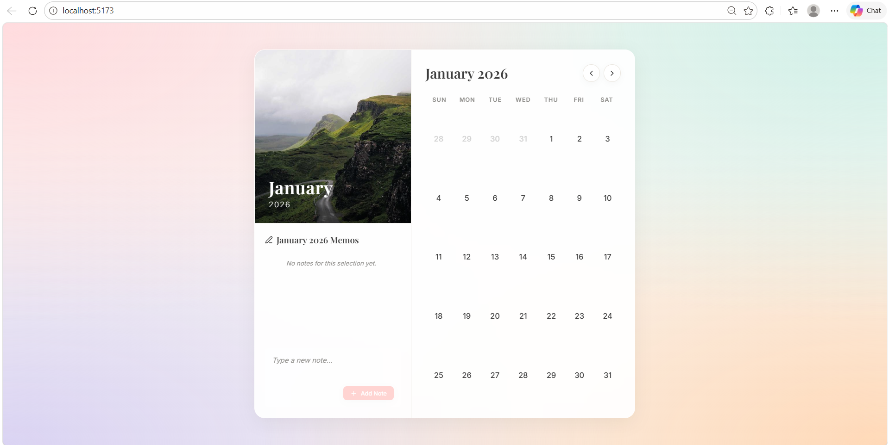

# CalenScape – Interactive Wall Calendar

A modern, responsive, and interactive wall calendar component built using Next.js. This project transforms a static calendar design into a dynamic and user-friendly experience with date range selection and integrated notes.

## Screenshots




## Features

* Wall calendar aesthetic inspired by physical calendars
* Hero image integrated with monthly calendar grid
* Date range selection (start date, end date, and highlighted range)
* Integrated notes section for monthly or date-specific notes
* Fully responsive design for desktop and mobile devices


## Tech Stack

* Next.js
* TypeScript
* Tailwind CSS


## Project Structure

```
├── public/              # Static assets
├── src/
│   ├── assets/          # Images and media files
│   └── components/      # Calendar, DatePicker, Notes components
├── index.html
├── package.json
├── vite.config.ts

```


## Installation & Setup

1. Clone the repository:   
   https://github.com/Jiya2406/CalenScape.git


3. Navigate into the project folder:  
   cd Calendar

4. Install dependencies:  
   npm install

5. Run the development server:  
   npm run dev

6. Open the application in your browser:  
   http://localhost:5173/

## Future Enhancements

* Theme switching (light/dark mode)
* Calendar flip animations
* Holiday and event markers
* Reminder and notification system

